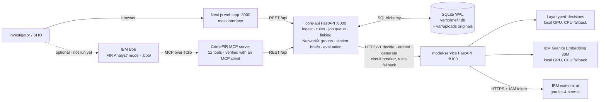
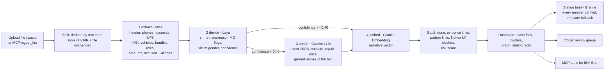

# Architecture

## System Architecture
Three running services plus a database. Only the **model service** loads AI models; everything else stays light.
The **web app is the main interface**. The MCP server is an extra, optional door into the same API for IBM Bob.

Solid lines are in use and verified. Dotted lines: the MCP server is implemented and verified end-to-end with an MCP
client (`src/mcp_server/smoke_test.py`), but IBM Bob itself has not been run with it yet.

## Components
| Component | Technology | Responsibility |
|---|---|---|
| Frontend (`src/frontend`) | Next.js 16, React 19, Tailwind, react-force-graph-2d, IBM Plex Sans + Roboto Mono (bundled, offline) | Dashboard, add/delete batches with live progress, sortable case files + officer review, repeat-offender groups with network and timeline graph views, station briefs, AI accuracy and usage |
| Core API (`src/core_api`) | Python 3.12, FastAPI, SQLAlchemy 2, NetworkX, numpy | Ingestion, rule-based evidence extraction, DB-backed job queue + worker, entity resolution, evidence/pattern links, clusters + risk, station facts/briefs, evaluation, REST API |
| Model service (`src/model_service`) | FastAPI, PyTorch (CUDA), `laya`, sentence-transformers, httpx | Loads models once. Provider adapters chosen in `models.yaml`. GPU-first with automatic CPU fallback. Serialised GPU access (HTTP 429 when busy). |
| Decision model | **Laya** `convaiinnovations/laya` typed-decisions (Apache 2.0) | Crime minor head (major derived), 24 MO flags, victim gender, with calibrated confidence |
| Embedding model | **IBM Granite Embedding** `ibm-granite/granite-embedding-30m-english` | 384-d vectors of the FIR story, used for pattern links |
| LLM | **IBM Granite** `ibm/granite-4-h-small` on **watsonx.ai** (eu-de) | Second opinion when Laya < 40% confident; factual summary; station brief prose |
| MCP server (`src/mcp_server`) | MCP Python SDK 2.x (stdio) | Exposes the core API as 12 tools. Verified: `smoke_test.py` starts it the way Bob would, lists the tools and calls them on the live API |
| IBM Bob config (`.bob/`) | `mcp.json`, `custom_modes.yaml`, `rules-fir-analyst/` | "FIR Analyst" mode: cite FIR ids, leads not guilt, privacy. Not yet loaded in a live Bob session |
| Database | SQLite in WAL mode | Input, processing state, output, usage, audit |
| Dataset (`src/dataset`) | Python generator + validator | 400 synthetic FIRs in NCRB I.I.F.-I layout, answer key, real-case sources |

## End-to-end data flow

1. **Ingest.** `POST /api/batches` validates the file (type, size ≤ 10 MB, ≤ 1000 FIRs), stores it unchanged under
   `var/uploads/<batch>/`, splits it, de-duplicates by SHA-256 of the text, parses the I.I.F.-I header, and creates
   one stage run per FIR per stage. It returns **202** with a status URL immediately.
2. **Background worker.** It claims micro-batches (extract 50, decide 16, enrich 1, embed 32) with **leases**. It
   retries transient errors with exponential backoff (up to 4 attempts), puts crashed work back in the queue on
   restart, and records the provider, model id, device and duration of every stage.
3. **extract (rules).** Hard identifiers with character spans and roles, the loss amount, the accused from the
   header and "alias" / "identified as" phrases, and claimed personas kept separately.
4. **decide (Laya).** 27 typed questions in one pass. Per-MO-flag thresholds come from
   `src/shared/calibration.json`, tuned on the dev split.
5. **enrich (Granite, only below 0.40).** Checks the monthly token budget first, then calls, validates, repairs
   once and grounds the result. If watsonx is unavailable, the FIR goes to the review queue.
6. **embed (Granite Embedding).** A unit vector of the narrative, stored as float32.
7. **Batch end.** Links and clusters are recomputed consistently, and the batch becomes COMPLETED or
   COMPLETED_WITH_ERRORS.

## Data model (SQLite)
| Kind | Tables |
|---|---|
| Input (immutable) | `ingest_batches`, `firs` (raw text never changes), original files in `var/uploads/` |
| Processing state | `fir_stage_runs`: WAITING → PENDING → RUNNING → SUCCEEDED / SKIPPED / FAILED, with attempts, lease, provider, model, device, error |
| Analysis | `fir_analysis` (auto-drafted I.I.F.-II), `entities` (value, raw, role, span, source), `embeddings` |
| Output | `links` (EVIDENCE / PATTERN + evidence JSON), `offender_clusters`, `cluster_members`, `station_reports`, `eval_runs` |
| Operations | `llm_usage` (token budget), `audit_log` (ingest, reviews, resets) |

## Reliability
- **Degradation ladder.** GPU → CPU per model (on load failure or runtime out-of-memory). If the model service is
  down, a circuit breaker (opens after 5 failures, stays open 30 s) switches decisions to keyword rules and marks
  those FIRs for review. If watsonx is down or over budget, the FIR goes to the review queue and briefs use the
  template.
- **Health.** `GET /api/health/ready` reports the database, worker heartbeat and model service
  (models, devices, GPU memory).
- **Idempotency.** Duplicate uploads are skipped, stages upsert their outputs, and
  `POST /api/system/reprocess-llm` re-runs only the missed LLM second opinions.
- **Responsive while busy.** SQLite allows one writer at a time, so the worker claims work in its own short
  transaction and commits before every model call. Uploads and deletes never wait behind a GPU or watsonx call.
  A busy database returns a JSON 503 ("try again") instead of a bare 500.
- **Stop.** `POST /api/batches/{id}/cancel` skips the queued work of a batch; once the running step ends, the
  worker removes the unfinished FIRs, keeps the analysed ones and recalculates the groups.

## Security and privacy
- Local by default. FIR text leaves the machine only for the ~13% of low-confidence FIRs sent to watsonx.ai
  (IBM Cloud, eu-de). Removing the credentials keeps everything local.
- Secrets live in `src/.env` (git-ignored). `src/.env.example` documents every variable.
- Complainant phone numbers are masked in API responses and never used as offender evidence.
- LLM output is schema-validated and grounded in the source text. LLM-written briefs are rejected if they contain
  any number that isn't in the computed facts.
- Every link and cluster is labelled "investigation lead, requires human verification". Officer confirmations
  and corrections are audited.
- `POST /api/system/reset` is disabled when `CRIMEFIR_ENV=production`. Authentication and role-based access are
  out of scope for the prototype (see Known Limitations).

## Scalability
- The core API has no ML dependencies and scales horizontally. The same worker loop runs as separate processes
  once `DATABASE_URL` points at PostgreSQL.
- Linking uses identifier indices (exact matches), not all-pairs AI comparison. Pattern links compare vectors
  only within the same crime type. For crore-scale data: PostgreSQL + pgvector (approximate top-k search), several
  model-service replicas behind a queue, and Laya batched on a GPU server.
- LLM usage is bounded by design (only low-confidence FIRs, one FIR per call, monthly token budget).
